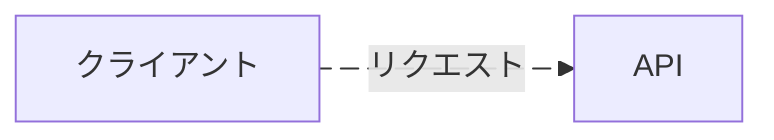

# エッジのアニメーション

通信の方向を強調する例。エッジ ID と `animation` に対応するレンダラーで使う。

```mermaid
flowchart LR
    client["クライアント"] request@-->|リクエスト| api["API"]
    request@{ animation: slow }
```

動きは方向の強調であり、通信中であることや処理速度を示さない。
停止しても矢印とラベルで意味を読み取れる。未対応の掲載先には次の静止版を使う。

```mermaid
flowchart LR
    client["クライアント"] -->|リクエスト| api["API"]
```
